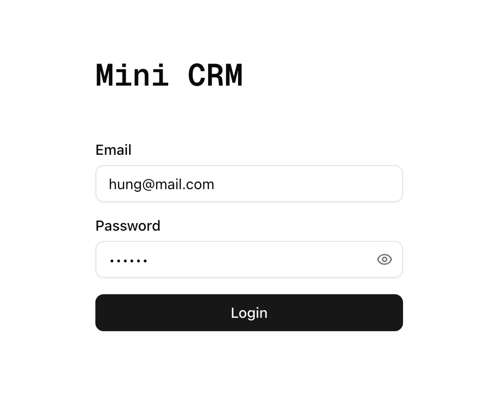
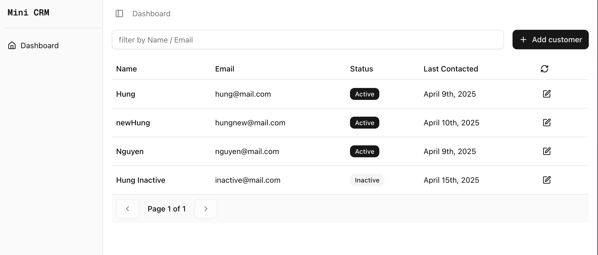
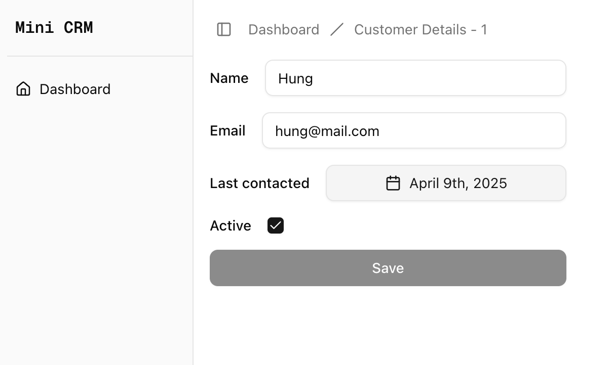

## Preview URL: [mini-crm.hungdangnguyen.com](https://mini-crm.hungdangnguyen.com/)

## Development server
```bash
npm run dev
```

Open [http://localhost:3000](http://localhost:3000) with your browser to see the result.

## Build and Serve
```bash
npm run build

# then

npm run start
```

Open [http://localhost:3000](http://localhost:3000) with your browser to see the result.

## Requirements
### 1. Authentication (Basic)
- [x] Implement a login page (email/password)
- [x] No real authentication required (store login state in localStorage or context)
- [x] Redirect to dashboard on successful login



---

### 2. Dashboard page
- [x] Show a list of customers with: Name, Email, Status (Active/Inactive), Last Contacted
- [x] Include a search bar to filter customers
- [x] Provide a button to add a new customer



---

### 3. Customer details page (/customers/[id])
- [x] Display full details of a selected customer
- [x] Allow editing customer info



---

### 4. API Integration (Real)
- [x] Create an API route (/api/customers) to return real customer data
- [x] Fetch data in the dashboard using React Query

---

### 5. Tech Stack
- [x] Next.js (latest version)
- [x] TypeScript
- [x] Tailwind CSS for styling
- [x] React Query (or SWR) for API fetching
- [x] Zod for form validation

---

### 6. Bonus
- [x] Implement pagination for customers
- [x] Allow adding new customers via a form
- [x] Connect to a PostgreSQL database (Supabase)
